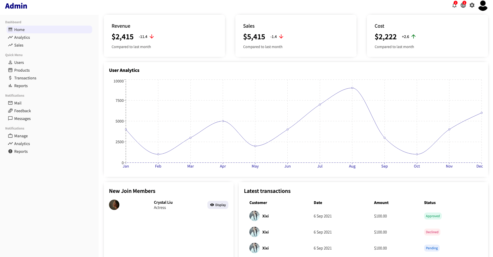

# Movie_App

Admin frontend


```
cd admin && npm install && npm start
```
Client frontend


```
cd client && npm install && npm start
```
Server backend
```
cd server && npm install && npm run devStart
```